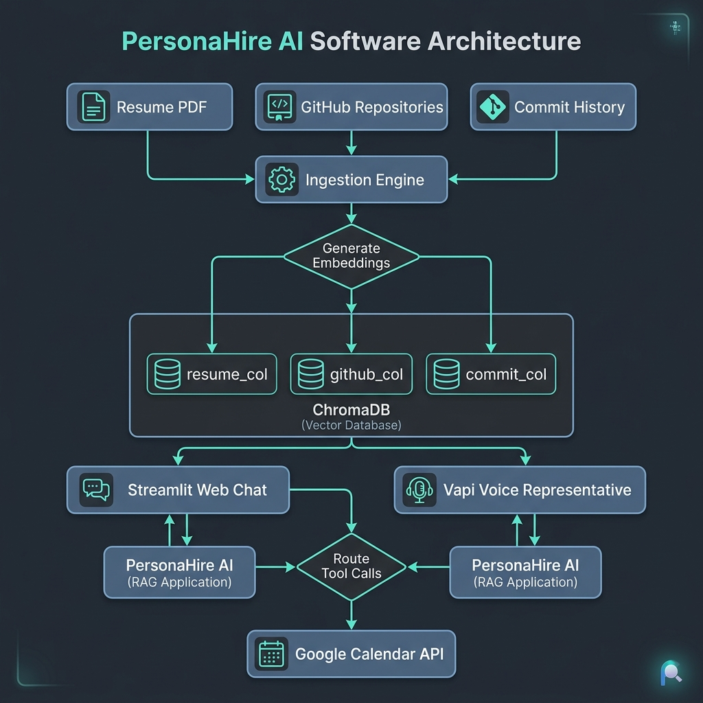
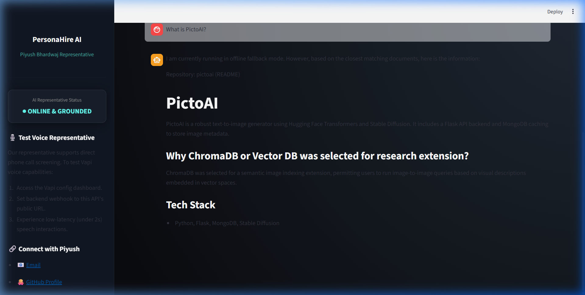
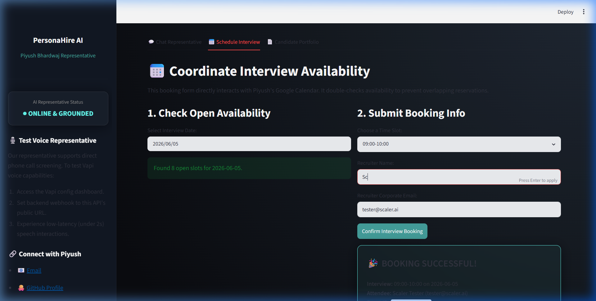

# 💼 PersonaHire AI

### *AI-Powered Candidate Representative & Autonomous Interview Scheduling Agent*

**PersonaHire AI** is a production-ready, high-fidelity AI Representative representing **Piyush Bhardwaj** (Computer Science candidate & AI Enthusiast). It handles detailed candidate Q&A (education, projects, published deepfake research, skills, and coding commit histories) and schedules recruiter interviews autonomously with real calendar integrations.

---

## 🚀 Key System Features

1. **Grounded Resume & GitHub RAG**: Indexes candidates' full resume PDF alongside public GitHub repository metadata, README structures, and recent commits.
2. **Hybrid Retrieval + Reranking Layer**: Combines semantic vector search (`text-embedding-3-small` in ChromaDB) with lexical keyword matching (`BM25Okapi`) merged via **Reciprocal Rank Fusion (RRF)**, then reranks candidates using a **Cross-Encoder Model** (`ms-marco-MiniLM-L-6-v2`) to prevent hallucination.
3. **Autonomous Scheduling**: Exposes scheduling endpoints connecting to the **Google Calendar API** with multi-thread locking and double-check **Conflict Protection** to prevent overlapping bookings.
4. **Voice Agent Channel**: Supports low-latency, WebRTC-enabled voice screenings via **Vapi**, **ElevenLabs** (Flash TTS), and **Deepgram** (Nova-2 STT).
5. **Prompt Injection Protection**: Features regex-based input guardrails that intercept and reject attempts to jailbreak the assistant, reveal instructions, or change its identity.
6. **Automated Evaluation Suite**: Standardized testing scripts measuring response latency, precision, recall, MRR, and booking completion rates, generating a print-ready PDF evaluation report.

---

## 📐 System Architecture



---

## 📸 Demo Screenshots

### 💬 Chat Representative Interface


### 📅 Autonomous Interview Scheduling


---

## 📂 Repository Structure

```text
persona-hire-ai/
├── backend/
│   ├── main.py            # FastAPI Web Server (Endpoints, CORS, Vapi webhook)
│   ├── ingest.py          # Data Ingestion (Resume parser, GitHub scraper)
│   ├── github_loader.py   # GitHub REST API Loader & Offline Fallback JSON
│   ├── chroma_store.py    # ChromaDB Manager (Semantic + BM25 search + RRF)
│   ├── reranker.py        # Cross-Encoder Reranker (ms-marco-MiniLM-L-6-v2)
│   ├── memory.py          # Sliding-Window Session Memory (Last 10 messages)
│   ├── audit_logger.py    # Structured JSONL Audit Logging
│   └── guard.py           # Guardrails (Jailbreak Shield)
├── frontend/
│   └── app.py             # Streamlit Multi-tab User Interface
├── voice_agent/
│   ├── vapi_config.json   # Vapi Assistant Import Schema
│   └── readme.md          # Voice setup guide
├── evaluation/
│   ├── golden_questions.json # 20+ Golden Benchmark Q&As & ground-truth sources
│   ├── evaluate.py        # QA, Latency, and Booking Eval
│   ├── retrieval_eval.py  # Context retrieval metrics (MRR, Recall, Precision)
│   └── generate_report.py # ReportLab PDF Compiler (evaluation_report.pdf)
├── data/
│   ├── resume.pdf         # Raw resume source PDF
│   └── github_mock.json   # Pre-populated high-fidelity repository metadata fallback
├── docs/
│   ├── cost_breakdown.md  # Detailed API & hosting monthly budget
│   └── architecture.png   # Architecture diagram visual
├── README.md
├── requirements.txt
└── render.yaml            # Render deployment blueprint
```

---

## ⚙️ Local Setup & Configuration

### 1. Clone & Set Up Virtual Environment
```bash
git clone https://github.com/piyushxbhardwaj/persona-hire-ai.git
cd persona-hire-ai

# Create virtual environment
python -m venv venv
# Activate on Windows:
.\venv\Scripts\activate
# Activate on Linux/macOS:
source venv/bin/activate
```

### 2. Install Dependencies
```bash
pip install -r requirements.txt
```

### 3. Environment Variables (`.env`)
Create a `.env` file in the root folder based on [`.env.example`](.env.example):
```env
OPENAI_API_KEY=your_openai_api_key
GITHUB_TOKEN=your_personal_github_token
GOOGLE_CALENDAR_CREDENTIALS_JSON=your_service_account_json_as_a_string
```
*Note: If no Google credentials or GitHub tokens are set, the system **gracefully falls back** to stateful local JSON scheduling and offline high-fidelity repository mocks respectively. If no OpenAI key is set, the system generates stable hash-based mock embeddings, allowing complete offline development and verification.*

---

## 💾 Running the RAG Ingestion

Run the ingestion pipeline to parse the resume PDF, fetch GitHub metrics, and initialize the separate ChromaDB collections:
```bash
python backend/ingest.py
```

---

## 🖥️ Running the Application

### 1. Launch FastAPI Backend
```bash
python backend/main.py
```
API docs will be available at: http://localhost:8000/docs

### 2. Launch Streamlit Frontend
In a new terminal window:
```bash
streamlit run frontend/app.py
```
Open your browser to: http://localhost:8501

---

## 🛡️ API Documentation

### **Health Check Nodes**
- `GET /health` - Verifies API server is online.
- `GET /health/rag` - Reports vector collection sizes (`resume`, `github`, `commit`).
- `GET /health/calendar` - Checks calendar operation mode (Mock vs Google Live).

### **Core Services**
- `POST /api/chat` - Submits user query for RAG processing.
  - *Payload:* `{"query": "...", "session_id": "..."}`
  - *Response:* `{"answer": "...", "sources": [...], "session_id": "..."}`
- `GET /api/calendar/slots` - Lists free slots for a date.
  - *Params:* `?date=YYYY-MM-DD`
- `POST /api/calendar/book` - Schedules an interview.
  - *Payload:* `{"date": "YYYY-MM-DD", "slot": "HH:00-HH:00", "email": "...", "name": "..."}`
- `POST /api/voice/chat/completions` - Webhook stream endpoint for Vapi voice connection.

---

## 📊 Evaluation & PDF Reports

To execute the automated evaluation framework and generate the system report:
1. Run retrieval checks: `python evaluation/retrieval_eval.py`
2. Run QA and booking tests: `python evaluation/evaluate.py`
3. Compile report PDF: `python evaluation/generate_report.py`

This creates a publication-quality **`evaluation_report.pdf`** in the project root.

---

## ☁️ Deployment Instructions

### **Backend (FastAPI)**
The project includes a [`render.yaml`](render.yaml) file for Render hosting:
1. Create a new account on **Render** (render.com).
2. Connect your Git repository.
3. Render automatically picks up `render.yaml` and provisions a Web Service.
4. Input your secrets (`OPENAI_API_KEY`, etc.) in the Render Environment Variables tab.

### **Frontend (Streamlit)**
1. Host your code on GitHub.
2. Sign in to **Streamlit Community Cloud** (share.streamlit.io).
3. Click **New App**, select your repo, branch, and set `Main file path` to `frontend/app.py`.
4. Add `BACKEND_API_URL` under the Advanced App Settings pointing to your Render deployment URL.
